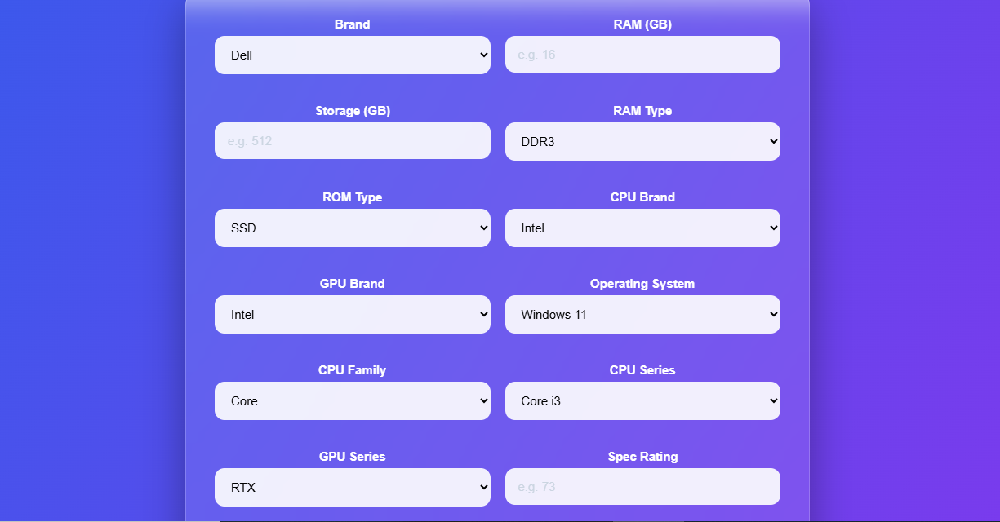
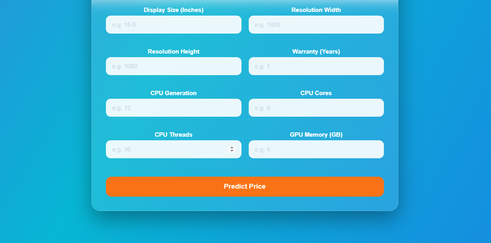
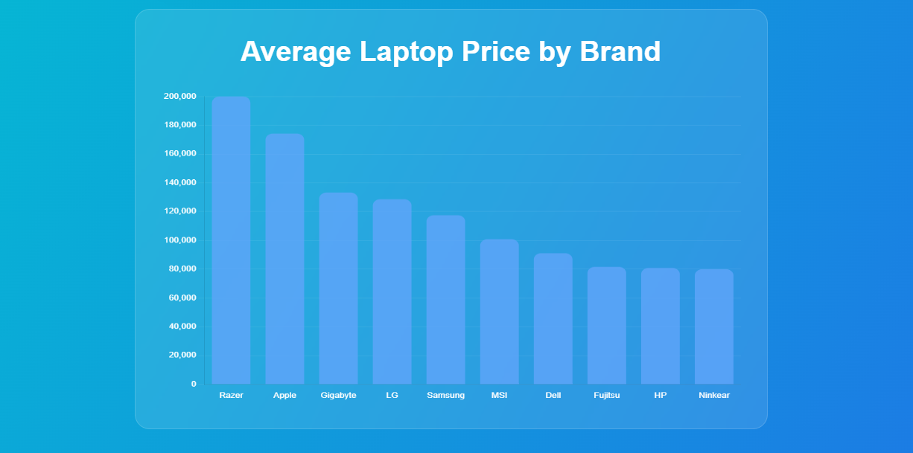
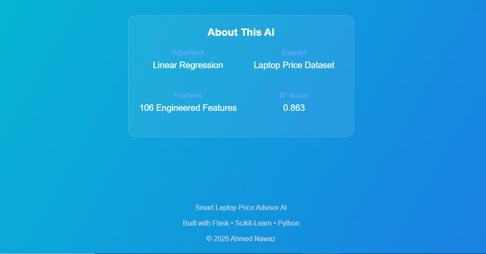

# Smart Laptop Price Advisor AI

A Machine Learning powered Flask web application that predicts the **Estimated Laptop Price** using laptop hardware specifications.


![Python]
![Flask]
![Scikit-Learn]
![HTML5]
![CSS3]
![JavaScript]
![Render]


### Live Demo

https://smart-laptop-price-advisor-ai.onrender.com/

### GitHub Repository

https://github.com/gmafsd775/Project_3_Smart_Laptop_Price_Advisor_AI_Flask


---

# Table of Contents

- Project Overview
- Key Features
- Technology Stack
- Dataset
- Machine Learning Workflow
- Feature Engineering
- Model Training and Selection
- Model Performance
- Hyperparameter Tuning
- Final Model Selection
- Project Structure
- Installation
- Usage
- Deployment
- Screenshots
- Future Improvements
- Key Learning Outcomes
- Author
- Acknowledgements

---

# Project Overview

Smart Laptop Price Advisor AI is an end-to-end Machine Learning project developed using **Python** and **Flask**. The application predicts the **Estimated Laptop Price** based on laptop hardware specifications entered by the user through a modern web interface.

The project demonstrates the complete Machine Learning lifecycle, beginning with raw data preprocessing and feature engineering, followed by training multiple regression algorithms, evaluating their performance, selecting the most suitable model, integrating it into a Flask web application, and finally deploying the application on Render.

The primary objective of this project is to provide users with an easy-to-use interface that estimates laptop prices using Machine Learning while also demonstrating production-ready ML deployment.

> **Note**
>
> The original Kaggle dataset used in this project does **not specify any currency**. Therefore, the application intentionally displays **Estimated Laptop Price** instead of assuming PKR, USD, or any other currency.

---

# Key Features

- End-to-end Machine Learning project
- Real-time laptop price prediction
- Interactive Flask web application
- Clean and responsive user interface
- Automatic feature engineering
- One-Hot Encoding for categorical variables
- Multiple Machine Learning model comparison
- Hyperparameter tuning using GridSearchCV
- Production deployment using Render
- Organized project structure
- GitHub portfolio ready

---

# Technology Stack

## Programming Language

- Python 3.13

## Backend

- Flask 3.1.3
- Gunicorn

## Frontend

- HTML5
- CSS3
- JavaScript

## Machine Learning

- Scikit-learn 1.9.0
- Pandas
- NumPy
- Joblib

## Development Tools

- Jupyter Notebook
- Visual Studio Code
- Git
- GitHub
- Render

---

# Dataset

**Dataset Name**

Laptop Price Prediction Dataset

**Source**

Kaggle

**Dataset File**

```text
data/laptop_price.csv
```

The dataset contains laptop specifications such as:

- Brand
- RAM
- Storage
- CPU
- GPU
- Display
- Operating System
- Warranty
- Other hardware specifications

These features were cleaned, transformed and engineered before model training.

---

# Machine Learning Workflow

The project follows a complete end-to-end Machine Learning workflow.

1. Data Collection
2. Data Cleaning
3. Exploratory Data Analysis (EDA)
4. Feature Engineering
5. Data Preprocessing
6. Feature Encoding
7. Model Training
8. Model Evaluation
9. Model Comparison
10. Hyperparameter Tuning
11. Final Model Selection
12. Model Serialization
13. Flask Integration
14. Cloud Deployment

---

# Feature Engineering

The original dataset contained a limited number of raw features. Extensive preprocessing and feature engineering were performed before training the Machine Learning models.

The preprocessing pipeline includes:

- Brand One-Hot Encoding
- CPU Brand Extraction
- CPU Family Extraction
- CPU Series Extraction
- CPU Generation Extraction
- GPU Brand Extraction
- GPU Series Extraction
- RAM Type Encoding
- Storage Type (ROM Type) Encoding
- Operating System Encoding
- Display Resolution Processing
- Display Size Processing
- Warranty Processing
- Numerical Feature Cleaning
- Automatic Feature Alignment during Prediction

After preprocessing and encoding, the production model uses approximately **106 engineered features**.

All preprocessing steps performed during training are automatically applied inside **prediction.py** before generating predictions.

---

# Model Training and Selection

Instead of relying on a single Machine Learning algorithm, multiple regression models were trained and evaluated to identify the most suitable model for laptop price prediction.

The following regression algorithms were implemented and compared:

- Linear Regression
- Decision Tree Regressor
- Random Forest Regressor
- Extra Trees Regressor

Each model was evaluated using multiple performance metrics, including:

- R² Score
- Mean Absolute Error (MAE)
- Root Mean Squared Error (RMSE)

To further improve performance, **Random Forest Regressor** was optimized using **GridSearchCV**.

The final production model was selected after comparing all evaluation metrics rather than choosing a model solely based on training performance.

---

# Model Performance

| Model | R² Score | MAE | RMSE |
|------|---------:|---------:|---------:|
| **Linear Regression** | **0.863** | **14,001** | **21,640** |
| Extra Trees Regressor | 0.850 | 12,722 | 22,685 |
| Random Forest Regressor | 0.848 | 12,794 | 22,839 |
| Decision Tree Regressor | 0.720 | 15,770 | 30,949 |

---

# Hyperparameter Tuning

Random Forest Regressor was further optimized using **GridSearchCV**.

## Best Parameters

```python
{
    "max_depth": 20,
    "min_samples_leaf": 1,
    "min_samples_split": 2,
    "n_estimators": 100
}
```

## Best Cross Validation Score

```text
0.7785
```

## Tuned Random Forest Performance

| Metric | Value |
|---------|------:|
| R² Score | **0.8511** |
| MAE | **12,639** |
| RMSE | **22,586** |

Although tuning improved Random Forest performance, it did not outperform Linear Regression in terms of Test R² Score.

---

# Final Model Selection

After evaluating all regression models, **Linear Regression** was selected as the final production model.

### Reasons

- Highest Test R² Score
- Better generalization on unseen data
- Fast prediction speed
- Simple architecture
- Lightweight deployment
- Suitable for real-time Flask applications

The trained model was serialized using **Joblib** and integrated into the Flask application for real-time predictions.

---

# Project Structure

```text
Project_3_Smart_Laptop_Price_Advisor_AI_Flask/
│
├── app.py
├── prediction.py
├── requirements.txt
├── README.md
├── Project_3_Smart_Laptop_Price_Advisor_AI.ipynb
│
├── data/
│   └── laptop_price.csv
│
├── model/
│   ├── laptop_price_model.pkl
│   └── feature_names.pkl
│
├── templates/
│   └── index.html
│
├── static/
│   ├── css/
│   │   └── style.css
│   │
│   ├── js/
│   │   └── script.js
│   │
│   └── images/
│
└── screenshots/
    ├── pagehome.png
    ├── input_1.png
    ├── input_2.png
    ├── prediction-result.png
    ├── brand_chart.png
    └── About_page.png
```

---

# Installation

## 1. Clone the Repository

```bash
git clone https://github.com/gmafsd775/Project_3_Smart_Laptop_Price_Advisor_AI_Flask.git
```

---

## 2. Navigate to the Project Folder

```bash
cd Project_3_Smart_Laptop_Price_Advisor_AI_Flask
```

---

## 3. Create a Virtual Environment (Optional)

### Windows

```bash
python -m venv venv
venv\Scripts\activate
```

### Linux / macOS

```bash
python3 -m venv venv
source venv/bin/activate
```

---

## 4. Install Dependencies

```bash
pip install -r requirements.txt
```

---

## 5. Run the Flask Application

```bash
python app.py
```

The application will be available at:

```text
http://127.0.0.1:5000
```

---

# Usage

Using the application is straightforward:

1. Open the web application.
2. Enter the laptop specifications.
3. Click the **Predict Price** button.
4. The application automatically preprocesses the user input.
5. The trained Machine Learning model generates an estimated laptop price.
6. The prediction is displayed instantly.
7. Users can also explore the Brand Distribution chart included in the application.

---

# Deployment

The application is successfully deployed on **Render** using **Gunicorn** as the production WSGI server.

## Live Demo

https://smart-laptop-price-advisor-ai.onrender.com/

The deployed application provides the same functionality as the local development version, allowing users to predict laptop prices directly from the browser.

---

# Screenshots

The following screenshots demonstrate the application's user interface and functionality.

## Home Page

The landing page provides an overview of the application along with a modern user interface.


---

## Input Form (Part 1)

Users can enter the primary laptop specifications required for prediction.



---

## Input Form (Part 2)

Additional hardware specifications are collected before making the prediction.



---

## Prediction Result

After submitting the form, the trained Machine Learning model predicts the **Estimated Laptop Price** instantly.


---

## Brand Distribution Chart

The application also includes a visualization showing the distribution of laptop brands in the dataset.



---

## About the Model

The application provides a brief overview of the Machine Learning model and feature engineering process.



---

# Future Improvements

This project can be further enhanced with the following improvements:

- Improve mobile responsiveness for a better user experience.
- Add more laptop brands and hardware specifications.
- Train and evaluate advanced boosting algorithms such as XGBoost, LightGBM, and CatBoost.
- Display feature importance and model explainability using SHAP.
- Add prediction confidence or price range estimation.
- Store prediction history using a database.
- Implement user authentication and personalized dashboards.
- Containerize the application using Docker.
- Deploy using CI/CD pipelines for automated updates.

---

# Key Learning Outcomes

This project provided hands-on experience in:

- Data Cleaning and Preprocessing
- Exploratory Data Analysis (EDA)
- Feature Engineering
- Feature Encoding
- Training Multiple Machine Learning Models
- Model Evaluation
- Performance Comparison
- Hyperparameter Tuning using GridSearchCV
- Model Serialization with Joblib
- Flask Web Application Development
- Frontend Integration using HTML, CSS, and JavaScript
- Git and GitHub Version Control
- Cloud Deployment using Render

---

# Challenges Faced

During the development of this project, several practical challenges were encountered and successfully resolved:

- Cleaning inconsistent laptop specifications.
- Designing an effective feature engineering pipeline.
- Aligning prediction inputs with trained model features.
- Comparing multiple Machine Learning algorithms.
- Hyperparameter tuning for Random Forest.
- Integrating the trained model with Flask.
- Managing project structure for deployment.
- Resolving Git authentication issues.
- Successfully deploying the application on Render.

---

# Author

## Ahmed Nawaz

Machine Learning Student

### GitHub

https://github.com/gmafsd775

---

# Acknowledgements

Special thanks to the following technologies and platforms that made this project possible:

- Kaggle for providing the Laptop Price Prediction Dataset.
- Scikit-learn for Machine Learning algorithms and tools.
- Flask for the web application framework.
- Pandas and NumPy for data processing.
- Joblib for model serialization.
- Render for cloud deployment.
- Git and GitHub for version control and project hosting.

---

# License

This project is created for **educational and portfolio purposes**.

Feel free to fork the repository, explore the implementation, and learn from the project. If you use or adapt this work, please provide appropriate credit by linking back to the original repository.

---

<div align="center">

## Smart Laptop Price Advisor AI

**An End-to-End Machine Learning Project Built with Python, Flask, and Scikit-learn**

**Live Demo:**  
https://smart-laptop-price-advisor-ai.onrender.com/

**GitHub Repository:**  
https://github.com/gmafsd775/Project_3_Smart_Laptop_Price_Advisor_AI_Flask

⭐ If you found this project helpful, consider giving the repository a star.